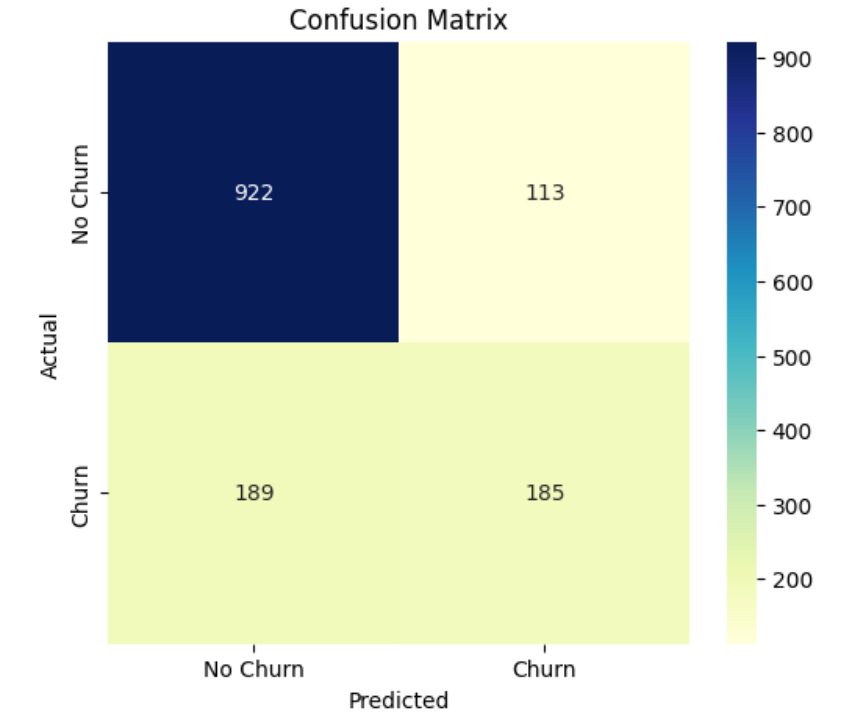
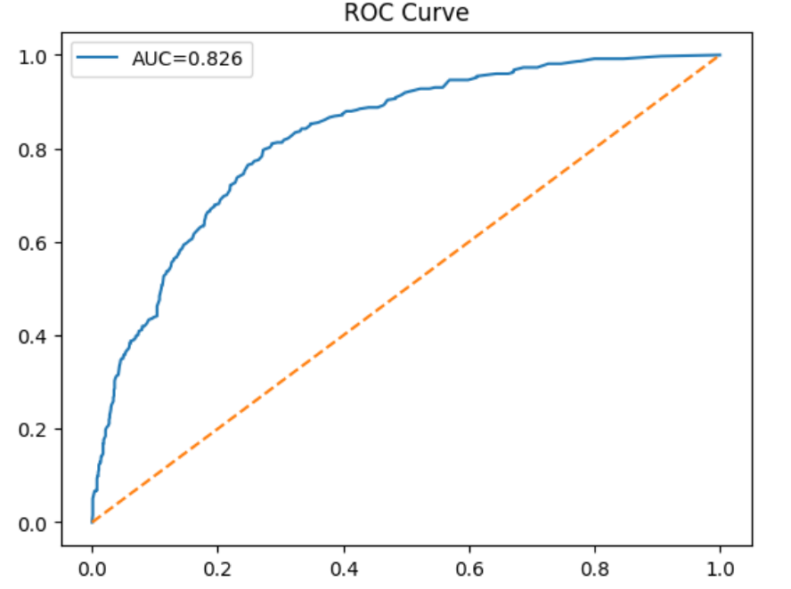
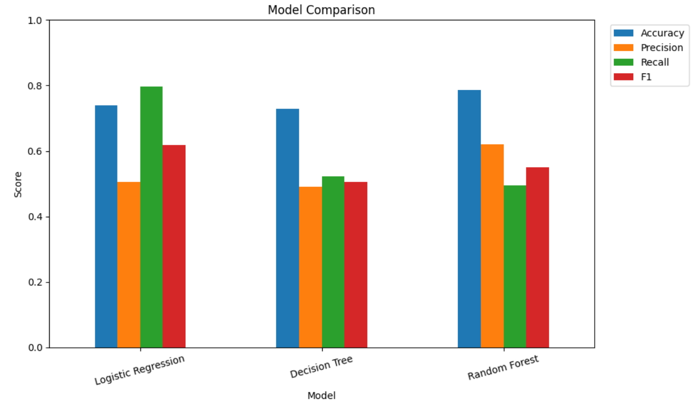
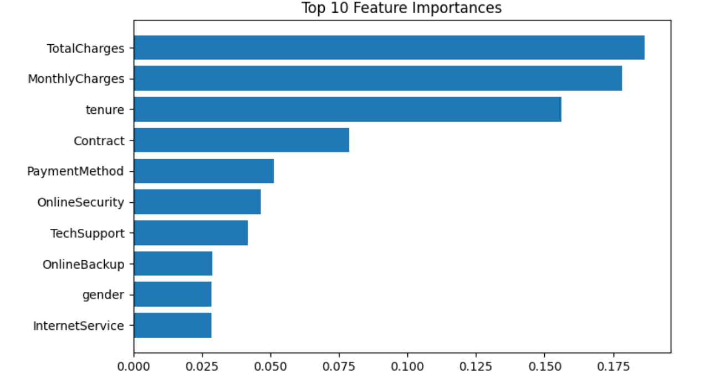

# Customer Churn Prediction using Machine Learning

## Overview
This project develops a machine learning model to predict customer churn, helping businesses improve retention and reduce revenue loss through data-driven insights. It applies a complete ML pipeline, including data preprocessing, exploratory data analysis (EDA), feature engineering, model training, and evaluation.

## Models Used
- Logistic Regression
- Decision Tree
- Random Forest

## Evaluation Metrics
- Accuracy
- Precision
- Recall
- F1-score

## Result
Among the implemented models, Random Forest achieved the best performance with approximately **78% accuracy**.

## Visualizations
### Confusion Matrix

### ROC Curve

### Model Comparison

### Feature Importance

## Files
- `churn.ipynb` — main notebook
- `README.md` — project documentation
- `images/` — visualization images

## Conclusion
This project demonstrates how machine learning can be used to analyze customer behavior and support data-driven business decisions.
